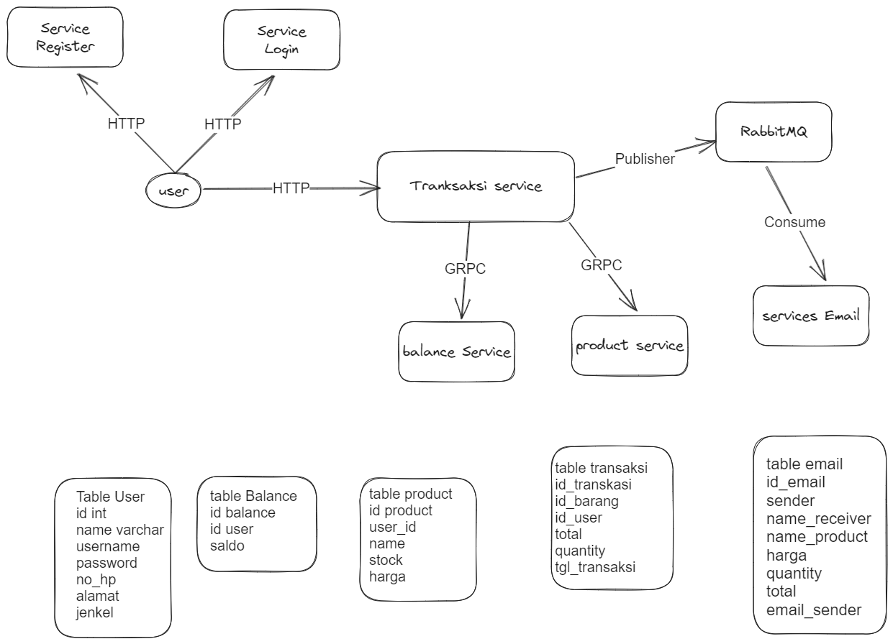

# Learn Microservices

## ARSITECTUR AND TABLE

### MODE RESTful

### MODE GRPC

## Endpoint:

1. User :

- /register [POST]
- /login [POST]

2. Balance :

- /balance [GET] => GetAll data balance
- /balance [POST] => add new data balance
- /balance/:id [GET] => find data balance from user id
- /balances/:id [GET] => find data balance from id
- /balance/:id [PUT] => Update data balance from id
- /balance/:id [PUT] => Update data balance using by service transakstion
- /balance/:id [DELETE]

3. Email :

- /email [POST]

4. Product :

- /product [GET] => GetAll
- /product [POST] => CreateProduct
- /product/:id [GET] =>get product by id
- /product/:id [PUT] =>update product by id
- /products/:id [PUT] =>update product using by service taransaksi
- /product/:id [DELETE]

 5. Product :

- /transaksi [POST] => create transaksi

## USING :

- Dockerfile
- Docker compose
- Postgresql
- RabbitMQ
- nginx
